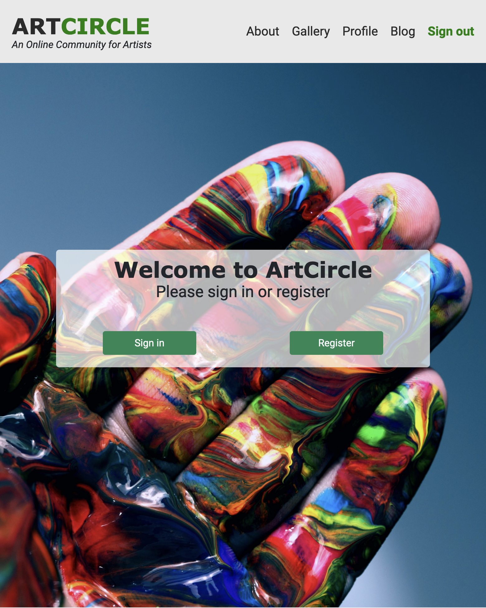
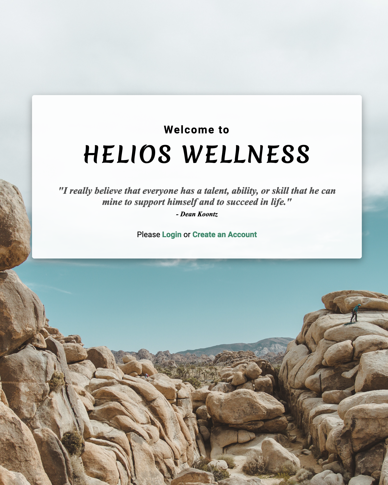
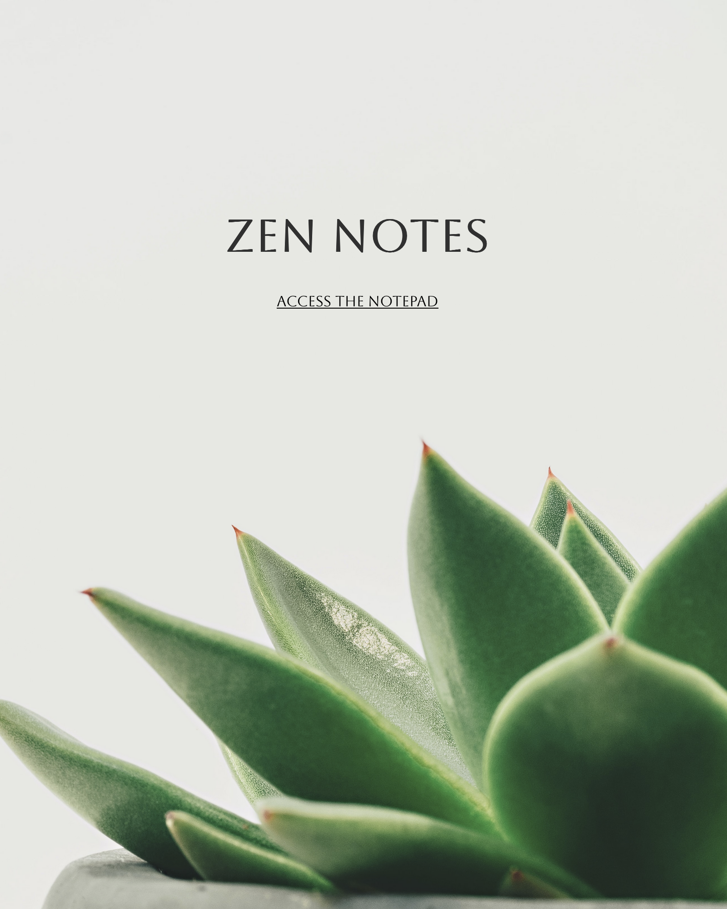

  
  

I'm a passionate Software Engineer with a proven track record of creating and implementing successful full stack web applications. I love software development's creative and technical aspects and am passionate about all things tech-related! As a problem solver at heart, I love the perpetual learning involved with software engineering and enjoy the dynamic nature of development.

See [my website](https://laurasims.dev) for more information!

<h1 align="center">Recent Projects</h1>
<table bordercolor="#66b2b2">
  
  <tr>
    <td width="50%" valign="top">
      <h3 align="center">ArtCircle</h3>
         
        
         
      
   
        
      
      

      
 A social media application providing an online art community for artists and creatives to connect, socialize, to find inspiration, and to inspire others. Users will be able to upload artwork to share with the community, and to give and receive feedback on the artwork.

    </td>
    <td width="50%" valign="top">
    <h3 align="center">Virtual Book Club</h3>
       
      
       
    

          
    
  
    

    
A social app to promote reading. This web app offers users the ability to make public and private book reviews, and to read public reviews on the site.

  </td>
  </tr>
  <tr>
  <td width="50%" valign="top">
      <h3 align="center">Helios Wellness</h3>
         
        
         
      

          
    
  
    

    
A wellness journal, built using MVC architecture, has authentication to enable each user to login and have a personalized experience. The user will be able to input their daily notes, mood, exercise, sleep duration, and water intake. User can monitor their progress overtime to find patterns and identify influential factors relating to motivation and state of mind.

  </td>

  <td width="50%" valign="top">
      <h3 align="center">Zen Notes</h3>
         
      
         
        

          
  
  
      

    
A streamlined productivity application allowing users to quickly add, update, and delete their notes.

  </td>
  </tr>

</table>

<h1 align="center">Technologies</h1>

    
    
    
    
    
    
    
    
    

---

<h1 align="center">Connect</h1>

  
  

